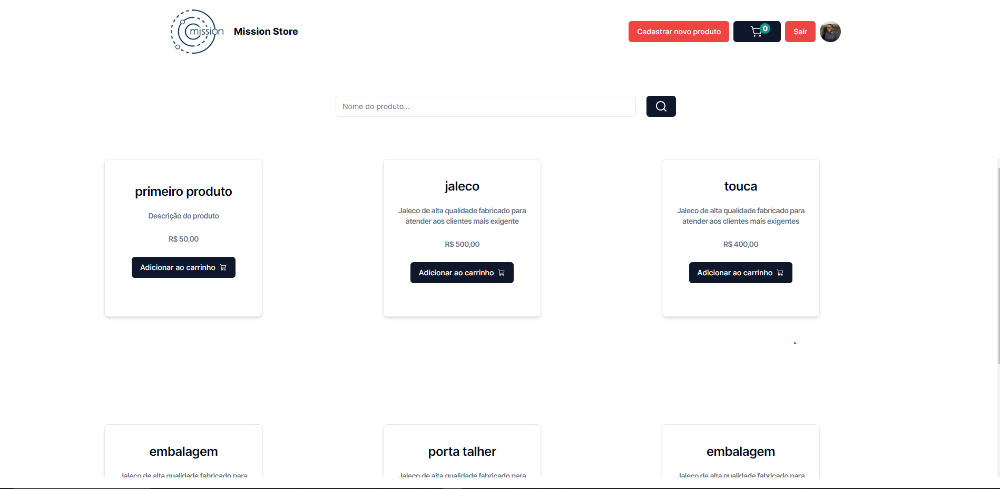
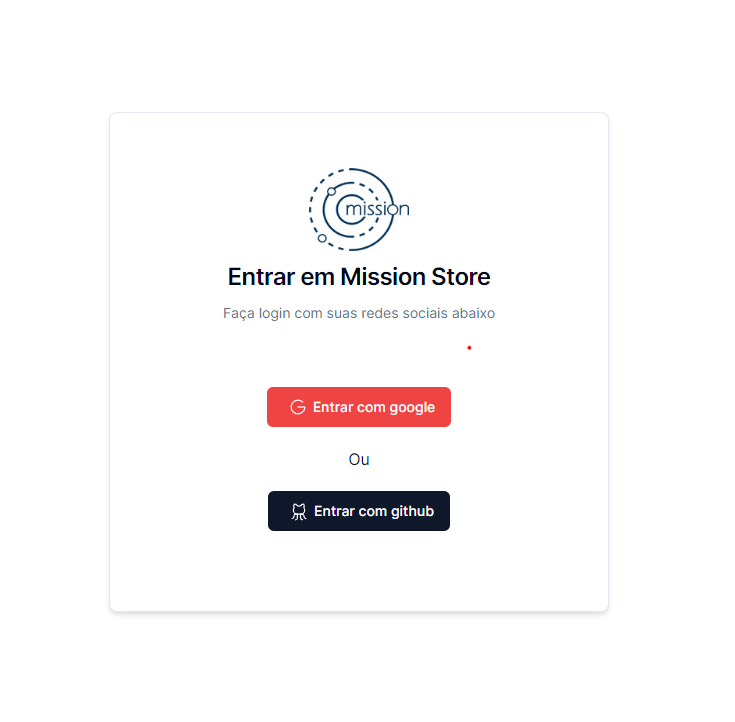

## Mission Store

# Demonstração do projeto

O projeto está no ar [http://mission-store.com.br](https://mission-store-u7o6.vercel.app/)

# Tecnologias Utilizadas

- NextJs(14)
- Zustand
- Typescript
- Shadcn/ui - radix-ui
- Zod
- Tailwind
- React Hook Form

# Recursos principais

- Criar um produto
- Adicionar o produto na loja
- Adicionar/remover produtos do carrinho de compras
- login

## Pré requisitos

- NodeJs > 20
- Nextjs > 14

## Estrutura do projeto

- `src/app/(products)`: Agrupamento de páginas tudo relacionado a produtos.
- `src/app/api/auth`: Configurações de autenticação.
- `src/components`: Components genéricos da aplicação.
- `src/components/ui`: Components genéricos da aplicação com shadcn/ui.
- `src/lib`: Configurações e utilitários.
- `src/store`: Store com estados globais(zustand).

# Demo

